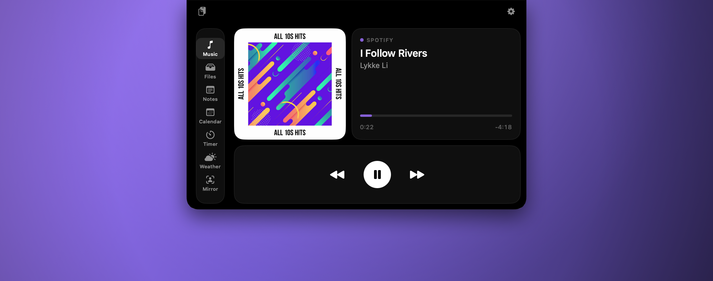

<div align="center">


<br>

[](https://github.com/MikaIsmayilov/Topnotch/releases/latest)
[](https://github.com/MikaIsmayilov/Topnotch/releases/latest)
[](LICENSE)

**Collapsed, it's a slim pill around the camera cutout that reacts to what's happening.**
**Swipe down with two fingers and it opens into a set of widgets.**

</div>

<br>

> [!NOTE]
> Topnotch has **no Dock icon and no window** — it lives in the notch. After launching,
> look for the pill at the top of your screen and swipe down on it. There's a menu bar
> item for quitting.

<div align="center">



<sub>Swiped open on the Music widget — the rail on the left switches between widgets, and the gear opens Settings.</sub>

</div>

## Install

1. Download **`Topnotch.dmg`** from the [latest release](https://github.com/MikaIsmayilov/Topnotch/releases/latest).
2. Open it and drag **Topnotch** onto the **Applications** shortcut.
3. Eject the disk image and launch Topnotch from Applications.

> [!IMPORTANT]
> **First launch needs a few extra clicks.** The app is ad-hoc signed and not notarized,
> so macOS blocks it the first time. This is expected — here's how to get past it:
>
> 1. Double-click **Topnotch**. macOS says it can't be opened. Click **Done**.
> 2. Open  **System Settings → Privacy & Security**.
> 3. **Scroll all the way down** to the **Security** section. You'll see
>    *"Topnotch was blocked to protect your Mac."*
> 4. Click **Open Anyway**, then authenticate with Touch ID or your password.
> 5. Confirm **Open Anyway** once more in the dialog that follows.
>
> You only do this once. From then on Topnotch launches normally.
>
> On macOS 14 you can instead right-click the app and choose **Open** — that shortcut was
> removed in macOS 15, which is why the steps above are the reliable path.
>
> Prefer the terminal? This does the same thing in one line:
>
> ```sh
> xattr -dr com.apple.quarantine /Applications/Topnotch.app
> ```
>
> This is all the trade-off of not paying for an Apple Developer ID certificate. If you'd
> rather not bypass Gatekeeper at all, [build it yourself](#build-from-source) instead.

## Widgets

| | |
|---|---|
| **Music** | Now playing from Spotify or Apple Music — artwork, a scrubbable progress bar, transport controls, and an accent colour pulled from the album art. Click the art to jump to the player. |
| **Files** | A drop shelf. Drag files onto the notch to stash them, drag them back out anywhere. |
| **Notes** | A scratch pad that autosaves. |
| **Calendar** | Month grid plus the selected day's agenda, with a Join button for events that contain a video link. |
| **Timer** | Pomodoro with focus/break lengths and a cycle indicator. |
| **Weather** | Current conditions, a 12-hour forecast, and feels-like/humidity/wind. No API key needed (Open-Meteo). |
| **Mirror** | Live camera preview. |
| **Clipboard** | Recent copied text, capped at 50 entries. |

## The collapsed pill

It only grows as wide as it needs to be, and surfaces things without being opened:

- Album art and a live equalizer while music plays
- A running timer countdown
- A meeting starting within 15 minutes, with a countdown — tap its ✕ to dismiss it
- Battery on plug/unplug, and AirPods battery on connect

## Gestures

| Gesture | Action |
|---|---|
| Two-finger swipe **down** on the notch | Open |
| Two-finger swipe **up** | Close |
| Swipe **left / right** on the collapsed pill | Previous / next track |
| Click | Also opens — hover-to-open is off by default, enable it in Settings |

## Settings

The gear in the top-right of the open panel.

- **Accent colour** — eight swatches. What everything highlights with: the Join button,
  the day dots in the calendar, the player's progress bar. Album art still wins while
  *Accent from album art* is on; the swatch is what it falls back to.
- Hover behaviour, swipe sensitivity, and launch at login.
- Which widgets get a slot in the rail, and the timer's focus/break lengths.

## Requirements

- A MacBook Pro/Air with a notch. The cutout is measured from the display at runtime, so
  it adapts to whatever scaled resolution you run — notch width is a function of your
  display scaling, not your model. On a screen that reports no cutout (an external
  display, or a Mac without a notch) it falls back to a 200pt pill sized to that screen's
  own menu bar.
- macOS 14 or later.

## Permissions

Granted on first use, all optional — the relevant widget explains itself if you decline:

| | |
|---|---|
| **Calendar** | The calendar widget and meeting countdown |
| **Location** | Weather |
| **Camera** | The mirror |
| **Automation** | Reading and controlling Spotify / Music playback |

## Build from source

```sh
git clone https://github.com/MikaIsmayilov/Topnotch.git
cd Topnotch
./scripts/run.sh          # build, bundle, and launch
./scripts/release.sh      # build a distributable zip
./scripts/make_dmg.sh     # build the drag-to-Applications disk image
```

`build_app.sh` signs with the first code-signing identity it finds in your keychain, and
falls back to ad-hoc. Signing with a stable identity matters during development: an
ad-hoc signature is derived from the code hash, so it changes on every build and macOS
re-asks for every permission each time.

## Notes and limitations

- Now playing works with **Spotify and Apple Music**. It reads them over AppleScript
  rather than the system-wide Now Playing API, because macOS restricts the private
  `MediaRemote` framework to Apple-signed processes — it returns nothing for third-party
  apps, including for Apple's own Music.app.
- Clipboard history is **text only**, held in memory, and cleared on quit. Entries marked
  concealed (what password managers set) are never recorded.
- There's no Focus/Do Not Disturb indicator. `INFocusStatusCenter` reports `false` on
  macOS 26 even when authorized with Focus sharing enabled, and the older
  `~/Library/DoNotDisturb` files no longer exist.
- The app icon is drawn full-bleed because macOS 26 composites a legacy `.icns` into its
  own rounded container — artwork carrying its own squircle ends up visibly nested inside
  a second one. The cost is that on macOS 14 and 15, which apply no mask, the icon reads
  with square corners.

## License

MIT — see [LICENSE](LICENSE).
